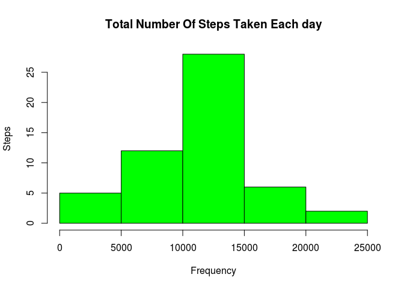
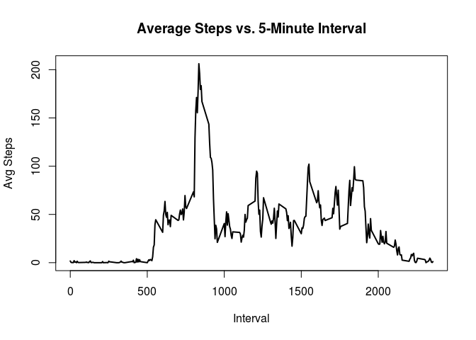
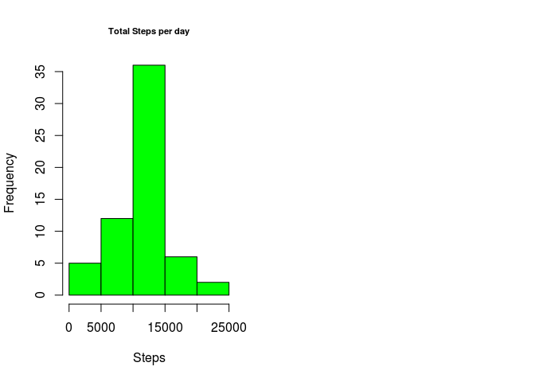
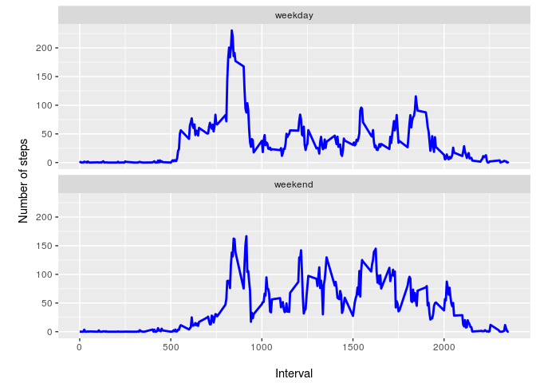

Introduction
------------

It is now possible to collect a large amount of data about personal
movement using activity monitoring devices such as a Fitbit, Nike
Fuelband, or Jawbone Up. These type of devices are part of the
“quantified self” movement – a group of enthusiasts who take
measurements about themselves regularly to improve their health, to find
patterns in their behavior, or because they are tech geeks. But these
data remain under-utilized both because the raw data are hard to obtain
and there is a lack of statistical methods and software for processing
and interpreting the data.

Dataset:
[activity.zip](https://d396qusza40orc.cloudfront.net/repdata%2Fdata%2Factivity.zip).

### 0. Load required libraries

    library(ggplot2)
    library(dplyr)

    ## 
    ## Attaching package: 'dplyr'

    ## The following objects are masked from 'package:stats':
    ## 
    ##     filter, lag

    ## The following objects are masked from 'package:base':
    ## 
    ##     intersect, setdiff, setequal, union

    library(chron)

### 1. Code for reading in the dataset and processing the data

    activity <- read.csv("activity.csv", header = TRUE)

### 2. Histogram of the total number of steps taken each day

    numberofsteps<- aggregate(steps ~ date, activity, FUN=sum)
    hist(numberofsteps$steps, 
         col="green", 
         xlab = "Frequency", 
         ylab = "Steps",
         main = "Total Number Of Steps Taken Each day")

### 3. Mean and median number of steps taken each day

    amean <- mean(numberofsteps$steps)
    amedian <- median(numberofsteps$steps)
    amean

    ## [1] 10766.19

    amedian

    ## [1] 10765

Mean and Median total number of steps taken per day are 10766.19 and
10765 respectively.

### 4. Time series plot of the average number of steps taken

    agginterval <- aggregate(steps ~ interval, activity, FUN=mean)
    plot(agginterval$interval, agginterval$steps, 
         type = "l", lwd = 2,
         xlab = "Interval", 
         ylab = "Avg Steps",
         main = "Average Steps vs. 5-Minute Interval")

### 5. The 5-minute interval that, on average, contains the maximum number of steps

    filter(agginterval, steps==max(steps))

    ##   interval    steps
    ## 1      835 206.1698

### 6. Code to describe and show a strategy for imputing missing data

    table(is.na(activity))

    ## 
    ## FALSE  TRUE 
    ## 50400  2304

    meaninterval<- aggregate(steps ~ interval, activity, FUN=mean)
    anew <- merge(x=activity, y=meaninterval, by="interval")
    anew$steps <- ifelse(is.na(anew$steps.x), anew$steps.y, anew$steps.x)
    head(anew)

    ##   interval steps.x       date  steps.y    steps
    ## 1        0      NA 2012-10-01 1.716981 1.716981
    ## 2        0       0 2012-11-23 1.716981 0.000000
    ## 3        0       0 2012-10-28 1.716981 0.000000
    ## 4        0       0 2012-11-06 1.716981 0.000000
    ## 5        0       0 2012-11-24 1.716981 0.000000
    ## 6        0       0 2012-11-15 1.716981 0.000000

    anew <- select(anew, steps, date, interval)
    head(anew)

    ##      steps       date interval
    ## 1 1.716981 2012-10-01        0
    ## 2 0.000000 2012-11-23        0
    ## 3 0.000000 2012-10-28        0
    ## 4 0.000000 2012-11-06        0
    ## 5 0.000000 2012-11-24        0
    ## 6 0.000000 2012-11-15        0

### 7. Histogram of the total number of steps taken each day after missing values are imputed

    aggsteps_new<- aggregate(steps ~ date, anew, FUN=sum)
    par(mfrow=c(1,2))
    hist(aggsteps_new$steps, 
         col="green",
         xlab = "Steps", 
         ylab = "Frequency",
         ylim = c(0,35),
         main = "Total Steps per day",
         cex.main = 0.7)

### 8. Panel plot comparing the average number of steps taken per 5-minute interval across weekdays and weekends

    table(is.weekend(anew$date))

    ## 
    ## FALSE  TRUE 
    ## 12960  4608

    anew$dayofweek <- ifelse(is.weekend(anew$date), "weekend", "weekday")
    table(anew$dayofweek)

    ## 
    ## weekday weekend 
    ##   12960    4608

    head(anew)

    ##      steps       date interval dayofweek
    ## 1 1.716981 2012-10-01        0   weekday
    ## 2 0.000000 2012-11-23        0   weekday
    ## 3 0.000000 2012-10-28        0   weekend
    ## 4 0.000000 2012-11-06        0   weekday
    ## 5 0.000000 2012-11-24        0   weekend
    ## 6 0.000000 2012-11-15        0   weekday

    meaninterval_new<- aggregate(steps ~ interval + dayofweek, anew, FUN=mean)
    head(meaninterval_new)

    ##   interval dayofweek      steps
    ## 1        0   weekday 2.25115304
    ## 2        5   weekday 0.44528302
    ## 3       10   weekday 0.17316562
    ## 4       15   weekday 0.19790356
    ## 5       20   weekday 0.09895178
    ## 6       25   weekday 1.59035639

    ggplot(meaninterval_new, aes(x=interval, y=steps)) + 
      geom_line(color="blue", size=1) + 
      facet_wrap(~dayofweek, nrow=2) +
      labs(x="\nInterval", y="\nNumber of steps")

